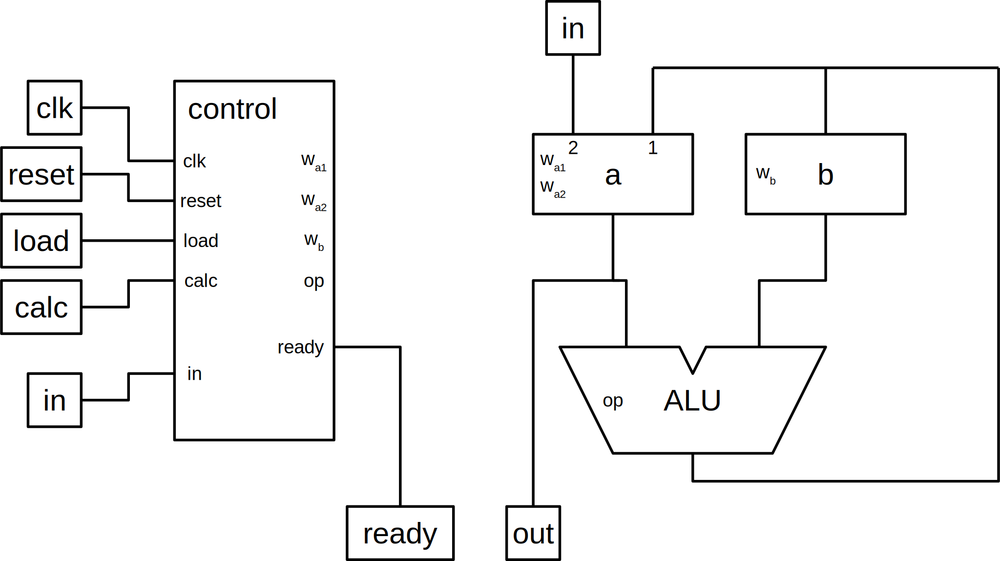

Calculadora simple implementable en Verilog
===========================================

Especificaciones
----------------

### Entradas/salidas

  * clk: señal de reloj
  * reset: puesta a cero
  * load: carga dato en registro de entrada
  * calc: calcula la operación seleccionada
  * in[7:0]: dato de entrada y código de operación
  * out[7:0]: salida del contenido del acumulador
  * ready: indicador estado inicial, listo para operar

### Registros

  * a: acumulador
  * b: registro auxiliar

### Operación

|condición   | operación        |
|------------|------------------|
| load       | a <- in; b <- a  |
| calc       | rd <- oper(a,b)  |

rd es a o b según la operación.

Las operaciones se seleccionan con los bits de `in`:

| in[3:0] | operación  |
|--------:|------------|
|   0001  | a <- a + b |
|   0010  | a <- a - b |
|   0100  | a <- b     |
|   1000  | b <- a     |

Todos los números se representan en complemento a 2.

### Ejemplo de operación

Realizar la operación 3 + 5

1. Se codifica "3" en las entradas "in".
1. Se activa "load". El registro "a" se carga con el valor "3" y el registro "b" se carga con el anterior valor de "a". En la salida "out" se observa el valor de "a" 3.
1. Se codifica "5" en las entradas "in".
1. Se activa "load". El registro "a" se carga con "5" y el registro "b" se carga con "3". En la salida "out" se observa el valor de "a" 5.
1. Se selecciona la operación de suma en las entradas "in": 0001.
1. Se activa "calc". La calculadora hace la operación. El resultado se almacena en "a" y la salida "out" muestra el resultado de la operación "8".

Diseño
------

### Unidad de datos

#### Registro a

  * Carga desde la ALU (wa1)
  * Carga desde in (wa2)

#### Registro b

  * Carga en paralelo (wb)

#### ALU

Operaciones de la ALU

| op    | bus   |
|------:|-------|
|   00  | a + b |
|   01  | a     |
|   10  | a - b |
|   11  | b     |

### Archivos

* `calculator.v`: módulos de la calculadora.
* `calculator_tb.v`: banco de pruebas de la calculadora.
* `system.v`: conexión de la calculadora con módulo de 7 segmentos.
* `seg7_4d_ctrl.v`: controlador de visor de 7 segmentos.
* `boards/`: archivos para implementación en placas de desarrollo.
